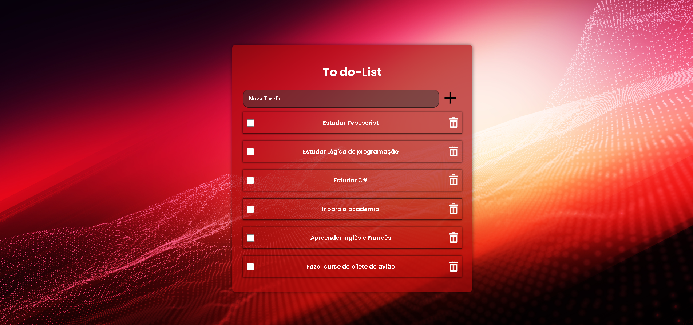

# ✅ Todo List com CRUD

Aplicação Full Stack de gerenciamento de tarefas desenvolvida com React e TypeScript, utilizando operações CRUD integradas a uma API REST hospedada online.

O projeto possui interface responsiva, loading durante requisições assíncronas e persistência de dados através de uma API utilizando JSON Server.

## 📸 Preview



---

## 🚀 Demonstração

🔗 Frontend: https://to-do-list-eight-fawn-36.vercel.app/

🔗 API: https://todo-list-backend-1hj4.onrender.com/tarefa

---

## 🛠 Tecnologias utilizadas

### Frontend
- React
- TypeScript
- Sass
- Axios

### Backend
- JSON Server

### Deploy
- Vercel
- Render

---

## ✨ Funcionalidades

- ✅ Adicionar tarefas
- ✅ Editar tarefas
- ✅ Remover tarefas
- ✅ Listar tarefas
- ✅ Loading durante requisições
- ✅ Layout responsivo
- ✅ Integração com API REST

---

## 📦 Como executar o projeto

### Clone o repositório

```bash
git clone https://github.com/degobiscaia/to-do-list
```

---

### Instale as dependências

```bash
npm install
```

---

### Execute o projeto

```bash
npm run dev
```

---

## 🌐 API Online

A API está hospedada no Render utilizando JSON Server.

⚠️ O Render Free pode demorar alguns segundos na primeira requisição.

---

## 📚 Aprendizados

Durante o desenvolvimento deste projeto foram praticados conceitos como:

- Componentização
- Consumo de API REST
- Requisições assíncronas
- Gerenciamento de estados
- Loading e tratamento de erros
- Deploy de aplicações Frontend e Backend
- Integração entre frontend e backend

---

## 👨‍💻 Autor

Desenvolvido por Diego Biscaia.